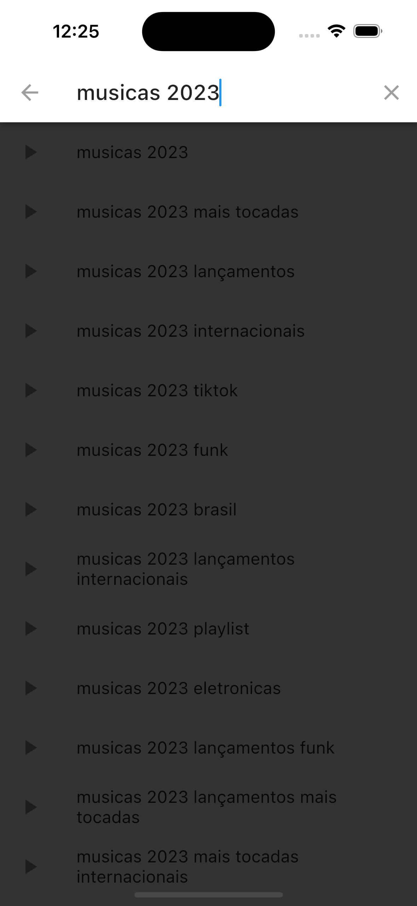
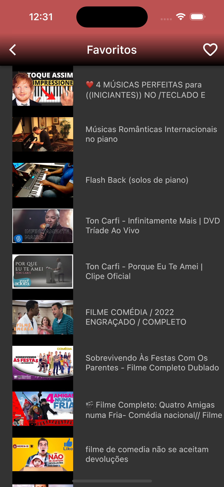

# favoritos_youtube
<h1 align="center">Favoritos Youtube: </h1>
<h1 align="center">
</h1>

🚧  Flutter 🚀 Em construção...  🚧

<h1 align="center">
<a href="https://pub.dev/"> Flutter</a></h1>

🚀 

    

 

</h4>
<a href="#Descrição">Descrição</a> •
<a href="#Experiencia">Experiencia</a> •
<a href="#Features">Features</a> •
<a href="#Bibliotecas">Features</a> •
<a href="#Rodar">Rodar</a> • 
<a href="#Observacoes">Rodar</a> •
<a href="#Telas">Telas</a> •  

 

## Descrição

App para você salvar seus favoritos do Youtube.

 

## Experiencia
Aprendi a consumir a API do Youtube disponibilizada pelo Firebase, coloquei em prática conceitos de Streams, fiz também o uso com "Bloc Pattern" para organizar e gerenciador as mudanças, deixando assim o código separado da regra de negócio, facilitando as atualizações e manutenções de crescimento do App. Utilizei também o Shared Preferences para armazenar os dados e o rxdart pra controle da sessão.
Segue abaixo mais detalhes desta experiência.

 

### Features
- [x] Pesquise pelo seu vídeo
- [x] Utiliza rolagem infinita
- [x] Adicione vídeos a página de favoritos
- [x] Exiba sua lista de favoritos

 

### Bibliotecas
- [x] bloc_pattern: ^1.3.0
- [x] rxdart: ^0.20.0
- [x] shared_preferences: ^2.1.1
- [x] http: ^0.12.0
- [x] youtube_player_flutter: ^8.1.2
- [x] flutter_youtube: ^1.1.4

 

### Rodar
- [x] Fazer Clone do Projeto
- [x] Baixar dependencias "Flutter pub get"
- [x] Fazer Build "Flutter run"

 

### Observacoes
- [x] Caso queira ver todos os comandos do build_runner "flutter build_runner --help"
- [x] Caso queira fazer Build para limpar arquivos gerado pelo provider "flutter build_runner clean"
- [x] Caso queira fazer Build para gerar arquivos gerenciados pelo provider "flutter build_runner watch"

 

### Telas
<h1 align="center">

